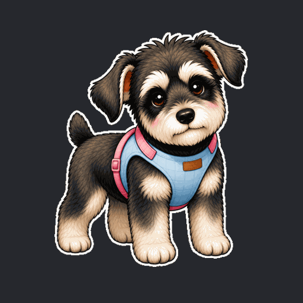

<p align="center">
  
</p>

<h1 align="center">Coco — 做你自己的桌面宠物 🐾</h1>

<p align="center">
  纯本地 · 无需服务器 · 借 LLM 聊天 · 本地提醒 · 一张照片换成你家的猫狗
</p>

<p align="center">
  
  
  
</p>

一只活在 macOS 桌面上的透明小宠物：会呼吸、会撒娇、能喂养 / 打工 / 上学 / 玩耍 / 聊天，还会把日常记进生活时间轴。

**默认 100% 本地运行**——`npm start` 就有一只陪着你，不需要任何服务器、不需要联网。
想要跨设备 / 微信提醒？再选配自己的云端即可（见下）。

换一张你自己宠物的照片 + 一套生成的逐帧动画，它就变成**你家的**那只猫 / 狗 / 任何动物。

<p align="center">
  
  
  
  
  
</p>
<p align="center"><sub>喂饭 · 上学 · 打工 · 玩耍 · 撒娇 —— 共 57 个动作，养成你自己的宠物</sub></p>

---

## 三步开跑

```bash
npm install      # 1. 装依赖（需先装 Node.js LTS）
npm start        # 2. 启动，桌面立刻出现一只 Coco
```

3. 鼠标悬停宠物 → 出现按钮（打招呼 / 打工 / 面板 / 聊天 / 时间轴）。拖动身体可移动。

> 零配置即可玩：没有任何配置文件时自动进入**纯本地离线模式**。

> 🤖 **用 Codex 搭？** 直接让它读 [`skills/local-desktop-pet/SKILL.md`](skills/local-desktop-pet/SKILL.md)（纯本地一条龙）和 [`skills/pet-art-forge/SKILL.md`](skills/pet-art-forge/SKILL.md)（照片换造型）。

---

## 聊天大脑（可选，纯本地）

默认用内置预设台词，完全离线也能逗它。想让它真正"会聊天"，复制配置填一个 API key：

```bash
cp coco.config.example.json coco.config.json
```

```jsonc
{
  "mode": "local",
  "brain": {
    "provider": "deepseek",          // anthropic | openai | deepseek | ollama
    "apiKey": "你的key",
    "model": "deepseek-chat"
  }
}
```

- 选 `ollama` 可接本机离线大模型，**零成本零联网**也有智能对话。
- key 只存在本机 `coco.config.json`（已被 `.gitignore` 排除，永不入仓）。

## 本地提醒

聊天里直接说就行，到点弹**系统通知** + 宠物提醒你：

```
提醒我 18:00 喝水
提醒我 30分钟后 站起来活动
/提醒 23:30 睡觉
```

## 本地时间轴

宠物的日常活动 / 你的屏幕使用，都记在本地。点面板里的时间轴按钮，用内置离线网页查看，**不联网、无密码**。

---

## 造一只属于你的宠物

美术流水线是**照片驱动**的：给一张你家宠物的真实照片，用提示词把它转成统一画风，先出"主视觉"确认像不像，再批量生成 57 个动作。详见 [`skills/pet-art-forge/`](skills/pet-art-forge/)。
> 该 skill 用到图生图（image2），推荐在 Codex 里跑。

---

## 选配：云端模式（跨设备 / 微信提醒）

需要自备一台 VPS。把 `mode` 改成 `"cloud"` 并提供 `link.config.json`（模板见 `link.config.example.json`）。
微信投递、跨设备转达只在云端模式可用。架构与部署见 [`docs/`](docs/)。

---

## 打包成 Mac App

```bash
npm run dist:mac      # 产物在 dist/（.dmg / .zip）
```
首次打开若提示"无法验证开发者"：右键 App → 打开，或到系统设置 → 隐私与安全性允许。

## 操作

- 拖动身体移动位置；悬停出现按钮（打招呼 / 跳 / 等待 / 打工 / 走动 / 退出）。
- 空闲时会舔爪爪、眨眼、四处张望。

## 安全

真实密钥从不入仓，详见 [`SECURITY.md`](SECURITY.md)。

## License

代码 MIT。美术素材单独授权——示例画风 / 参考图未经确权前请用你自己生成的素材替换。
